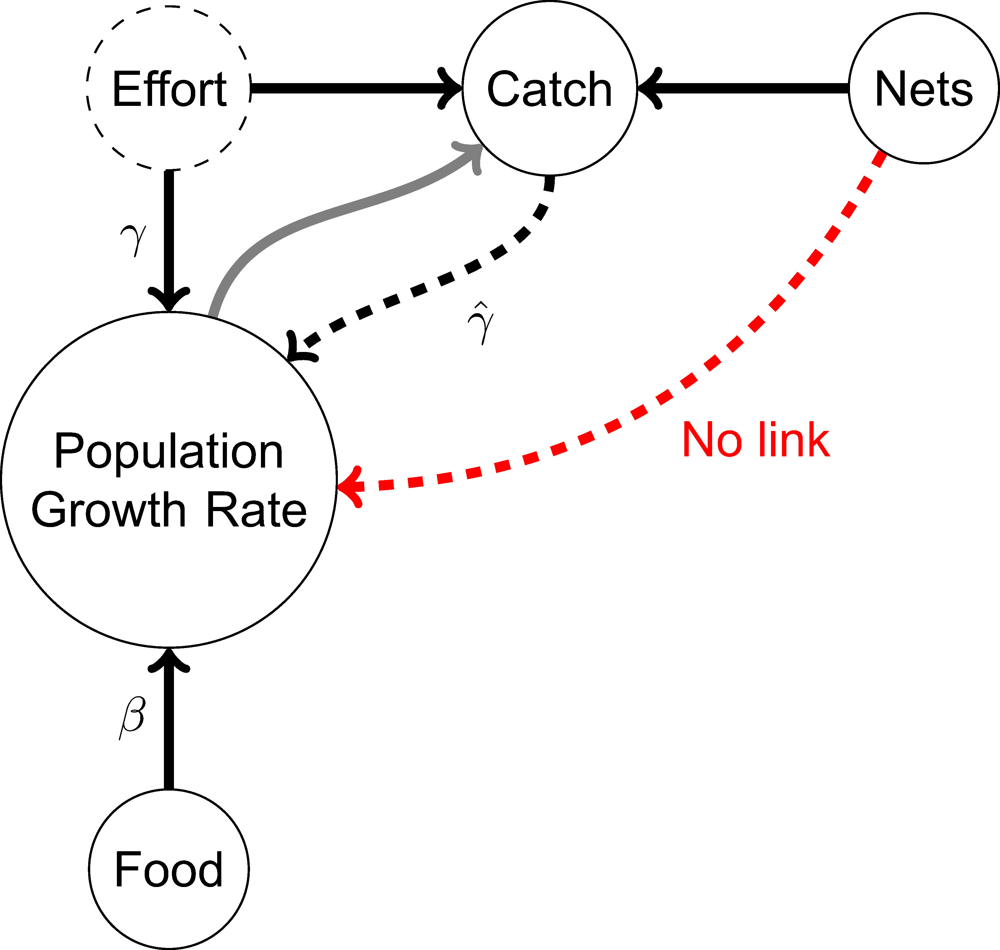

```{r setup, include=FALSE}
knitr::opts_chunk$set(echo = TRUE)
library(ggplot2)
library(reshape2)
library(cowplot)
library(scales)
library(ggpubr)
library(car)
library(DT)
library(sjPlot)
library(AER)
set.seed(1)
```

# Introduction

Society increasingly demands accurate predictions of complex ecosystem processes under novel conditions to address environmental challenges. Obtaining the process-level knowledge required to do so does not necessarily align with the burgeoning use in ecology of correlative model selection criteria such as Akaike's Information Criterion (AIC).

Information criteria select models based on their ability to reproduce outcomes, not their accurate representation of causal effects. Causal understanding does not require matching outcomes. It involves identifying model forms and parameter values that accurately describe processes. We argue that researchers can reach incorrect conclusions about cause-and-effect relationships by relying on information criteria.

This RMarkdown file is designed to walk through a concrete example involving a population of fish where inference extending beyond prediction into causality is misled by AIC. You can navigate through the example using the tabs on the left and use the button at the top right to toggle code folding.

# Motivating Example

Consider a system where the size of an herbivorous fish population at a given site is dependent on food availability ($kg/m^2$) and fishing effort ($hrs$) such that the log population growth rate ($yrs^{-1}$) is linear in these two factors (Main Text Fig. 1).



The researcher observes food abundance at each site but cannot observe fishing effort---a latent variable. Related models have been used to help understand the population dynamics of groundfish in the Atlantic. Assume that fishing effort at a site is independent of growth rate and that the true relationship is described by the model,

$$
Log(PopGrowth) = \beta Food + \gamma Effort + \eta 
$$

where the coefficient on the measure of food availability, $\beta$, takes the value of 0.5 and the catchability coefficient on effort, $\gamma$, is -0.08.

There is a residual unexplained error, $\eta$, that is normally distributed with mean zero and variance 0.01. The researcher is interested in predicting population growth rate in addition to recovering the parameter $\beta$.

```{r Simulating the Dataset, set.seed(1), class.source = 'fold-show', cache = TRUE}
# Initialize Parameters and Simulate Data
n <- 1000 # number of data points to construct
error.var.1 <- 0.01 # variance of the idiosyncratic error term
error.var.2 <- 0.2 # variance of error process for measurements of catch
true.beta <- 0.5 # coefficient on food availability term
true.gamma <- -0.08 # coefficient on fishing effort term

# Sample food availability data from uniform distribution
food <- (sample.int(101, size = n, replace = TRUE) + 50) / 200

# Sample fishing effort data similarly
effort <- (sample.int(201, size = n, replace = TRUE) - 1) / 100

# # Introduce multicollinearity
# food <- food+ 0.25*effort

# Sample fishing net data that will be used later for the IV approach
nets <- (sample.int(201, size = n, replace = TRUE) - 1) / 100

# Generate random normal error values for logpopgrowth and catch 
error.normal <- rnorm(n, 0, error.var.1)
error.normal2 <- rnorm(n, 0, error.var.2)

# Define data generating process for log population growth rate
logpopgrowth <- true.beta * food + true.gamma * effort + error.normal 

# Define data generating process for the measure of observed catch from fishing
catch <- effort + effort * 5*logpopgrowth +0.3 * nets + error.normal2
```

## Interactive Data Table

```{r Display Interactive Data Table}
# Create a dataframe structure and interactive datatable
df <- data.frame("Log.Pop.Growth" = logpopgrowth, "Food.Avail" = food, "Catch" = catch)
df40 <- df[1:40, ] # parse out first 40 observations
datatable(df, rownames = FALSE, filter="top", options = list(pageLength = 5, scrollX=T) )

# head(df)
# min(logpopgrowth) # to check minimum growth rate 
```

# Model 1: Naive Model

The researcher knows that fishing effort influences the population growth rate and therefore wants to account for it. While the researcher cannot directly observe effort, an estimate of the effort, catch, is observed. The researcher constructs a linear model of the log growth rate as a function of food availability and catch and estimates it on the data.

```{r naive model, set.seed(1), class.source = 'fold-show', cache=TRUE}
# Model 1: N = 40
naive.md40 <- lm(Log.Pop.Growth ~ Food.Avail + Catch, data = df40)
tab_model(naive.md40, show.aic=TRUE)
summary(naive.md40)
```

## Assessing Model 1

### Sample Size

Given knowledge of the true model, we can compare the parameter estimates to the true values. The coefficients are precisely estimated but the 95% confidence interval excludes the true values of $\beta = 0.5$ and $\gamma = -0.08$. This is not an issue of sample size. We can run the model on the larger sample of $N=1000$.

```{r naive model full, set.seed(1), class.source = 'fold-show', cache=TRUE}
# Model 1: N= 1000
naive.md <- lm(Log.Pop.Growth ~ Food.Avail + Catch, data = df)
naive.beta <- coefficients(naive.md)[2]
tab_model(naive.md, show.aic=TRUE)
summary(naive.md)
```

The model still appears to fit the data well (cf. Figure 4 from the main text).

```{r model 1 fit, cache=TRUE}
# This code reproduces Figure 4 from the main text.
naive.growth.pred <- predict(naive.md)
# create dataframe
df1 <- data.frame(cbind(food, logpopgrowth, naive.growth.pred))
names(df1) <- c("Food", "Actual", "Predicted")
df1.melt <- melt(df1, id.vars = "Food", variable.name = "Type", value.name = "logpopgrowth")
# create plots with ggplot
ggplot(df1.melt, aes(x = Food, y = logpopgrowth, shape = Type)) +
  geom_point(aes(colour = Type)) +
  scale_shape_manual(values = c("Actual" = 4, "Predicted" = 1)) +
  scale_colour_manual(values = c("Actual" = "black", "Predicted" = "red")) +
  theme_classic() +
  theme(text = element_text(size = 18), axis.text.x=element_text(colour="black"), axis.text.y=element_text(colour="black")) +
  xlab("Food availability") +
  ylab("Log population growth rate")
ggsave("Addicott_Figure4_v3.png", width = 10, height = 5)
```

With the larger sample the estimates are more precise, but the confidence interval still excludes the true value. The estimates from Model 1 are biased.

```{r estimates with endogeneity are inconsistent and biased}
# Replicating Figure 2 from the main text
beta.1 <- rep(NA, n - 39)
gamma.1 <- rep(NA, n - 39)
obs <- 40:n
for (j in 40:n) {
  md <- lm(Log.Pop.Growth ~ Food.Avail + Catch, data = df[1:j, ])
  beta.1[j - 39] <- coefficients(md)[[2]]
  gamma.1[j - 39] <- coefficients(md)[[3]]
}

df.md1 <- data.frame(cbind(obs, beta.1, gamma.1))

beta1plot <- ggplot(df.md1, aes(x = obs, y = beta.1)) +
  geom_line() +
  annotate("segment", x = 0, xend = n*1.01, y = true.beta, yend = true.beta, linetype = "dashed") +
  theme_classic() +
  theme(text = element_text(size = 17), axis.text.x=element_text(colour="black"), axis.text.y=element_text(colour="black")) +
  xlab("Observations") +
  ylab(expression(beta * ": Estimate of food parameter")) +
  scale_x_continuous(expand = c(0, 0), limits = c(0, n*1.1)) +
  scale_y_continuous(expand = c(0, 0), limits = c(0.4, 0.7)) +
  annotate("segment", x = n*1.01, xend = n*1.01, y = true.beta, yend = beta.1[n-40], colour = "red", size = 1, arrow = arrow(ends = "both", angle = 90, length = unit(.2, "cm"))) +
  annotate("text", label = "Bias", x = n-40, y = (beta.1[n-40] + true.beta) / 2, angle = 90, size = 5)

beta2plot <- ggplot(df.md1, aes(x = obs, y = gamma.1)) +
  geom_line(position = "identity") +
  theme_classic() +
  theme(text = element_text(size = 17), axis.text.x=element_text(colour="black"), axis.text.y=element_text(colour="black")) +
  xlab("Observations") +
  ylab(expression(gamma * ": Estimate of catch parameter")) +
  annotate("segment", x = 0, xend = n*1.01, y = -0.08, yend = -0.08, linetype = "dashed") +
  scale_x_continuous(expand = c(0, 0), limits = c(0, n*1.1)) +
  scale_y_continuous(expand = c(0, 0), limits = c(-.1, 0), breaks = c(-0.1, -0.08, -0.06, -0.04, -0.02, 0)) +
  annotate("segment",
    x = 1.01*n, xend = 1.01*n, y = true.gamma, yend = gamma.1[n-40],
    colour = "red", size = 1, arrow = arrow(ends = "both", angle = 90, length = unit(.2, "cm"))) +
  annotate("text", label = "Bias", size = 5, x = n-40, y = (gamma.1[n-40] + true.gamma) / 2, angle = 90)

cowplot::plot_grid(beta1plot, beta2plot, labels = c("a", "b"))
ggsave("Addicott_Figure2_v3.png", width = 10, height = 5)
```

### Multicollinearity and Variance Inflation

Multicollinearity is not the main issue. The correlation between catch and food availability is about 0.5:

```{r corr, class.source = 'fold-show', cache=TRUE}
 cor(catch, food)
```

And the variance inflation factors for the model's constituents are just above 1:

```{r vif, cache=TRUE}
 vif(naive.md40)
```

## Model 1 Is Confounded

The problem is that the observable estimate, catch, is influenced (confounded) by the growth rate---higher population growth leads to more catch---even though in this example the latent variable, effort, is independent. The primary issue is the dependence of catch on the outcome (i.e., population growth rate), which violates the mean zero error assumption required for unbiased estimation by ordinary least squares regression. The parameter estimates will not equal the true value in expectation (bias) and will fail to converge in probability to the true value (inconsistency).

All parameter estimates are impacted by this violation. It may not be surprising that $\hat{\gamma}$ diverges from $\gamma$. Indeed, $\hat{\gamma}$ describes the relationship between growth rate and catch, and catch is not identical to fishing effort. However, the estimate of the coefficient of interest, $\hat{\beta}$, is also impacted by the seemingly unrelated confound between catch and growth rate. Adding catch allows the model to better fit the growth rate distribution at the expense of introducing correlated error and confounding pathways.

Without prior knowledge of the misspecification, there are opportunities for the researcher to assess the results using, for example, the residuals plot.

```{r Residuals plot Model 1, cache=TRUE}
# Residual vs Fitted Plot for Model 1
ggplot(df1, aes(x = Predicted, y = Actual - Predicted)) +
  geom_point() +
  theme_classic() +
  geom_smooth(se = FALSE) +
  theme(text = element_text(size = 18), axis.text.x=element_text(colour="black"), axis.text.y=element_text(colour="black")) +
  xlab("Fitted") +
  ylab("Residuals")
ggsave("Addicott_Figure3_v3.png", width = 10, height = 5)
```

The observer may see the slight hump in the residuals, but the trend is not obvious.

# Model 2: A Simpler Model

The graph of the example system illustrates the assumption that there are no mediating factors between food availability and population growth rate. If this is correct, then the direct relationship is recovered in a simpler model by regressing growth rate on food availability without any consideration of fishing effort or catch.

```{r simple model, cache=TRUE}
# Model 2: N = 1000
simple.md <- lm(Log.Pop.Growth ~ Food.Avail, data = df)
tab_model(simple.md, show.aic=TRUE)
summary(simple.md)
```

Notice that this model does not fit the data as well as Model 1, but it does produced an unbiased estimate of $\beta$. With this new model and the causal intuition from the graph, the researcher might reject the hypothesis that the estimate from the simple model is equal to the estimate from the model including catch and gain insight that either using catch as an estimate of effort is problematic or that there are omitted covariates that mediate the relationship between food availability and growth rate.

```{r}
# Replicating Figure 2 from the main text
beta.2 <- rep(NA, n - 39)
beta.2.low <- rep(NA, n - 39)
beta.2.high <- rep(NA, n - 39)

for (j in 40:n) {
  md <- lm(Log.Pop.Growth ~ Food.Avail, data = df[1:j, ])
  beta.2[j - 39] <- coefficients(md)[[2]]
  beta.2.low[j - 39] <- confint(md)[2, 1]
  beta.2.high[j - 39] <- confint(md)[2, 2]
}

df.md2 <- data.frame(cbind(obs, beta.2, beta.2.low, beta.2.high))

ggplot(df.md2) +
  geom_line(aes(x = obs, y = beta.2)) +
  geom_line(
  aes(x=obs, y = beta.2.low),  linetype = "dashed") +
  geom_line(aes(x=obs, y=beta.2.high), linetype = "dashed")+
  annotate("segment", x = 0, xend = 1010, y = true.beta, yend = true.beta, linetype = "dashed") +
  theme_classic() +
  theme(text = element_text(size = 17), axis.text.x=element_text(colour="black"), axis.text.y=element_text(colour="black")) +
  xlab("Observations") +
  ylab(expression(beta * ": Estimate of food parameter")) +
  scale_x_continuous(expand = c(0, 0), limits = c(0, 1100)) +
  scale_y_continuous(expand = c(0, 0), limits = c(0.4, 0.75)) 
```

# Model 3: Instrumental Variables Model

One might wish to account for fishing effort and arrive at an unbiased estimate of the effect of food availability on growth rate. Doing so requires purging the observed estimate of effort (catch) of its relationship to growth rate. The instrumental variables (IV) approach, from the large literature on statistical tools to improve observational estimates, can isolate the variation in catch that is not due to changes in growth rate.

This approach requires a variable---the instrument---that affects catch but does not impact growth rate except indirectly through catch. If we know that variation in the number of fishing nets induces corresponding changes in catch, and that variation in nets has no other pathway to influence population growth rate, then we can isolate the directed pathway from nets to catch to growth rate.

Here, we can use fishing net availability as an IV. The number of nets available directly influences the ability to catch fish but has no other effect on growth rate. The IV estimates can be reached through two-stage least squares estimation by predicting the confounded variable (catch) using the instrument (number of nets).

```{r first stage, class.show='fold-source'}
# First stage of IV procedure

#Add nets data to the data frame
df$Nets <- nets
f.stg <- lm(Catch ~ Nets + Food.Avail, data = df)
tab_model(f.stg)
f.stg.coeff <- coefficients(f.stg)
```

We don't require that fishing net availability fully explains catch, just that it affects catch and is not otherwise influencing population growth rate (i.e., it is excludable).

In a second stage, we then regress growth rate on the prediction from the first stage. This procedure allows us to separate the variation in catch that is driven by net availability.

```{r second stage, class.show='fold-source'}
df$Catch.Hat <- predict(f.stg)
s.stg <- lm(Log.Pop.Growth ~ Food.Avail + Catch.Hat, data = df)
tab_model(s.stg)
s.stg.beta <- coefficients(s.stg)[2]
```

This can also be accomplished using the IV estimator instead of two-stage least squares.

```{r iv estimator, class.show='fold-source'}
library(AER)
ivreg.md3 <- ivreg(Log.Pop.Growth ~ Catch + Food.Avail 
                  | Nets + Food.Avail, data = df, x=TRUE)
tab_model(ivreg.md3, show.aic=TRUE)
summary(ivreg.md3)
```

The food availability parameter is well estimated here. It is very close to 0.50, the true value and is significant at $\alpha=0.05$. We can also demonstrate that, contrary to Model 1, as we include more data, we arrive at estimates that approach the true value.

```{r iv over large samples, cache=TRUE}
beta <- rep(NA, n - 39)
beta.low <- rep(NA, n - 39)
beta.high <- rep(NA, n - 39)
for (jj in 40:n) {
  md <- lm(Log.Pop.Growth ~ Food.Avail + Catch.Hat, data = df[1:jj, ])
  beta[jj - 39] <- coefficients(md)[[2]]
  beta.low[jj - 39] <- confint(md)[2, 1]
  beta.high[jj - 39] <- confint(md)[2, 2]
}
df3 <- data.frame(cbind(obs, beta, beta.low, beta.high))
ggplot(df3) +
  geom_line(aes(x = obs, y = beta)) +
  geom_line(
    aes(x=obs, y = beta.low),  linetype = "dashed") +
  geom_line(aes(x=obs, y=beta.high), linetype = "dashed")+
  annotate("segment", x = 0, xend = 1000, y = true.beta, yend = true.beta, linetype = "dashed") +
  theme_classic() +
  xlab("Observations") +
  ylab(expression(beta * ": Estimate of food parameter")) +
  scale_x_continuous(expand = c(0, 0), limits = c(0, 1050)) +
  scale_y_continuous(expand = c(0, 0), limits = c(0.325, 0.75)) +
  theme(text = element_text(size = 18), axis.text.x=element_text(colour="black"), axis.text.y=element_text(colour="black"))
ggsave("Addicott_Figure5_v3.png", width = 10, height = 5)
```

And we can look at the residuals vs fitted plot to see that the error is resolved of obvious heteroskedasticity.

```{r}
logpopgrowth.pred <- predict(s.stg)
df_iv <- data.frame(cbind(logpopgrowth.pred, logpopgrowth, logpopgrowth.pred - logpopgrowth))
names(df_iv) <- c("Predicted", "Actual", "Residual")
ggplot(df_iv, aes(x = Predicted, y = Residual)) +
  geom_point() +
  theme_classic() +
  geom_smooth(se = FALSE) +
  theme(text = element_text(size = 18), axis.text.x=element_text(colour="black"), axis.text.y=element_text(colour="black")) +
  xlab("Fitted") +
  ylab("Residuals")
```

Now let's look at AIC. Interestingly, we find that the first model, though confounded, is a better fit to the data and using AIC would choose it over the second...

```{r Comparing AIC}
naive.AIC <- extractAIC(naive.md)[2]
simple.AIC <- extractAIC(simple.md)[2]

print(paste0("AIC Model 1: ", naive.AIC))
print(paste0("AIC Model 2: ", simple.AIC))
```

... and the IV model, Model 3.

```{r}
f.AIC <- extractAIC(f.stg)[2]
s.AIC <- extractAIC(s.stg)[2]

print(paste0("AIC Model 3: ", s.AIC))
```

# Conclusion

In the example, adding catch improves fit and AIC, but also introduces a confounding pathway that jeopardizes estimation of all model parameters. Using only AIC results in selecting a structurally incorrect model with unreliable parameter estimates over models that address the confounded predictor by either exclusion or using an IV to recover the underlying cause-and-effect relationship.

All three models fit the distribution of outcomes well, but the mis-specified model, Model 1, produces an outcome distribution closer to the data. The result highlights AIC's value for assessing model fit; however, inference that extends beyond fit and into the realm of causal inference is unsupported by IC without additional lines of evidence.

Information-criterion approaches can lend weight to the wrong model with parameter estimates that miss the mark with high confidence across all explanatory variables. Since most research endeavors are aimed at exploring outcomes and the processes that generate them, information criteria should be used with care.

